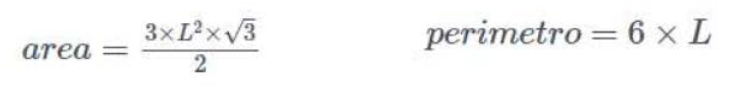

# Exercício - Calcular área e perímetro de um hexágono

Faça um programa, em linguagem C, para calcular a área e o perímetro de um hexágono. O programa deve implementar uma função chamada calc_hexa que calcula a área e o perímetro de um hexágono regular de lado L. O programa deve solicitar ao usuário o lado do polígono, calcular e imprimir a área e o perímetro do polígono. O programa termina quando for digitado um valor negativo qualquer para o lado. A função deve obedecer ao seguinte protótipo:

__void calc_hexa(float L, float *area, float *perimetro);__

Lembrando que a área e o perímetro de um hexágono regular são dados por:

Para os cálculos, obrigatoriamente você deve utilizar as funções sqrt e pow da biblioteca math.h.